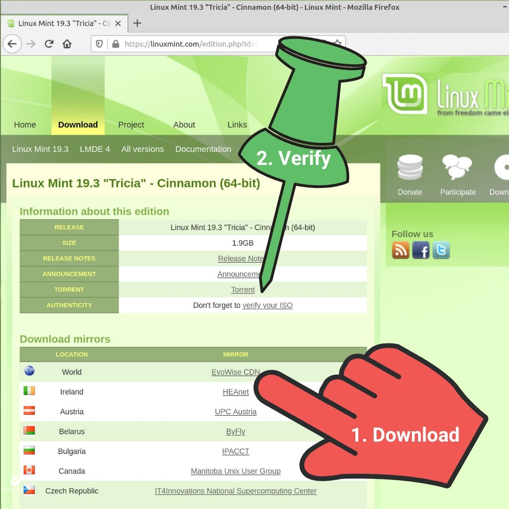

# Bitcoin

## Electronic Cash

**Bitcoin** is **money** for the **internet**. Bitcoin can be sent just like an **email**. The **Euro** has 2 decimal places, and €0.01 is called a **cent**. Bitcoin has 8 decimal places, and ₿0.00000001 is called a **satoshi**.

_**Many people already send and spend euros in digital form**_

## Satoshi Nakamoto

**Satoshi Nakamoto** is the pseudonym of the person (or persons) who **created Bitcoin**. The real identity of Satoshi Nakamoto is unknown. Satoshi is a masculine Japanese name meaning _wise_. A profile created by Satoshi on the forum [p2pfoundation](https://web.archive.org/web/20110317060514/http://p2pfoundation.ning.com:80/profile/SatoshiNakamoto) in 2008 indicated a **35-year-old male located in Japan**. There is much deliberation over the [identity](https://www.economist.com/technology-quarterly/2018/08/30/satoshi-nakamoto-bitcoins-enigmatic-creator) and motives of Satoshi Nakamoto.

_**The first block of the Bitcoin blockchain references the 3rd of January, 2009, Times headline**_

## Double Spend

It was in the autumn of **2008** that Satoshi Nakamoto published his infamous white paper [_**Bitcoin: A Peer-to-Peer Electronic Cash System**_](https://bitcoin.org/bitcoin.pdf). In it was an ingenious solution to a problem that had puzzled cryptographers for the previous two decades, the [**double spend**](https://www.investopedia.com/terms/d/doublespending.asp). The double-spend is to spend the same money a 2nd time.

_**Cheques can take days to clear**_

_**Cheques often fail to clear**_

## Trusted Third Party

Before Bitcoin, to send money over the internet, a **trusted third party** such as PayPal, MasterCard or Bank of Ireland, was needed. The trusted third party ensures that the sender has sufficient funds. They may also mediate disputes and issue chargebacks.

_**The Anglo Irish Bank circular inter-institution money deposit scam  
Source: [independent.ie](https://www.independent.ie/business/irish/anglo/6bn-fix-was-designed-to-make-bank-look-like-less-of-a-basket-case-29404959.html)**_

_**Abridged snippets of a phone conversation between David Drumm and John Bowe  
Source: [independent.ie](https://www.independent.ie/business/irish/anglo/6bn-fix-was-designed-to-make-bank-look-like-less-of-a-basket-case-29404959.html)**_

![Bowe: The dance to get it back in time [is] becoming very tough. We pay into the bank [Irish Permanent]. The bank gives it to the assurance company [Irish Life]. The assurance company gives it back to us [Anglo Irish Bank]. An abridged transcript of a taped phone conversation between David Drumm and John Bowe on September 29th, 2008.](../public/img/bitcoin/anglo-irish-bank-circular-inter-institution-money-deposit-scam-3.jpg)

_**Abridged snippets of a phone conversation between David Drumm and John Bowe  
Source: [independent.ie](https://www.independent.ie/business/irish/anglo/6bn-fix-was-designed-to-make-bank-look-like-less-of-a-basket-case-29404959.html)**_

## Distributed Ledger

Bitcoin turns on its head the **security model** that is the foundation of existing monetary systems. It **eliminates** the need for a trusted third party. Instead of a private, **centrally controlled** accounting ledger, Bitcoin proposes a **widely distributed public ledger** called a **blockchain**.

_**There are many copies of the Bitcoin ledger all over the internet**_

## Cryptography

**Electronic money (eMoney)** was a hot topic in **cryptography** circles since the dawn of the modern internet in the late 1980s and early 1990s. Cryptography keeps communication safe by **obscuring data** while it travels from the sender to the recipient. It would be crucial in any eMoney system, and this is why Bitcoin is known as a **cryptocurrency**.

_**[Invented by Julius Caesar](https://earlychurchhistory.org/military/julius-caesars-secret-code/) to frustrate attempts to intercept his personal and, especially, his military correspondence**_

## eMoney

There were attempts to create eMoney before Bitcoin. There was [**Ecash**](https://en.wikipedia.org/wiki/Ecash) in the early 1990s. Then there was [**Bit gold**](https://en.wikipedia.org/wiki/Nick_Szabo#Bit_gold), [**RPOW**](https://en.wikipedia.org/wiki/Proof_of_work#Reusable_proof-of-work_as_e-money) and [**b-money**](https://en.bitcoin.it/wiki/B-money). They all had issues, and eventually, they all failed. [**According to Satoshi**](https://web.archive.org/web/20110525181920/http://p2pfoundation.ning.com/forum/topics/bitcoin-open-source?commentId=2003008%3AComment%3A9493), attempts to create eMoney had failed because they were all centrally controlled.

_**Born in Tralee, Co. Kerry, [Richard Cantillon](https://en.wikipedia.org/wiki/Richard_Cantillon) is an inspiration for eMoney pioneers such as [Nick Szabo](https://twitter.com/NickSzabo4)**_

## Mining

In January 2009 Satoshi released free [open source](https://opensource.com/resources/what-open-source) software, [**Bitcoin Core**](https://github.com/bitcoin/bitcoin), for **creating** and **maintaining** the Bitcoin blockchain. The software runs a process known as **mining**. The mining process is a challenge between users of the software, who are known as **miners**. The aim is to be the first to solve a problem that is very difficult (but it’s easy to verify the solution).

_**It takes time and effort to solve a Rubik’s cube, but it’s easy to verify that it’s solved**_

## Proof-Of-Work

The mining process is more formally known as a [**proof-of-work**](https://en.wikipedia.org/wiki/Proof_of_work) system. Proof-of-work is an anti-spam technique. It's something like Google [Captcha's](https://en.wikipedia.org/wiki/CAPTCHA), where you must select some particular images (do some work) before you can access a website.

_**A CAPTCHA is a challenge to verify if the user is a human**_

## Wallet

In February 2009 Satoshi released the first Bitcoin **wallet** software to allow the **sending** and **storing** of Bitcoin. There are numerous hardware and software wallets available today. Hardware wallets claim increased security, but [nothing is entirely secure](https://westoahu.hawaii.edu/cyber/ledger-cryptocurrency-wallet-flaw/).

  

_**[Ledger hardware wallet](https://shop.ledger.com/pages/ledger-nano-x) and mobile app**_

## Address

A **Bitcoin address** is needed to receive and store Bitcoin. A Bitcoin wallet allows you to create multiple addresses, somewhat akin to having multiple bank accounts.

_**There is an almost infinite amount of possible Bitcoin addresses**_

## Pseudonymity

A Bitcoin address gives you **pseudonymity**. When Bitcoin is received, the **address of the recipient** and the **amount of Bitcoin received** is forever recorded and available for viewing on the public blockchain. It is said to be more **secure** and **private** to use a [new address](https://en.bitcoin.it/wiki/Address_reuse) for each transaction.

_**Bitcoin transactions are not entirely anonymous or untraceable**_

## Trust

Before the 1970s, if two parties wanted to **share encrypted data**, both parties needed access to the same password to either encrypt or decrypt the data. This password, technically known as a **secret symmetric key**, would have to be shared in a secure way such as by courier or registered mail. This process did not facilitate efficient business telecommunication. When [Whitfield Diffie](https://cisac.fsi.stanford.edu/people/whitfield_diffie) and [Martin Hellman](https://cisac.fsi.stanford.edu/people/martin_hellman) published their paper [New Directions in Cryptography](https://ee.stanford.edu/%7Ehellman/publications/24.pdf) in 1976, things changed.

_**Sharing a symmetric key is necessary but risky**_

## Public-Private Keys

Instead of a single secret symmetric key, Diffie & Hellman proposed **two asymmetric keys**. One **private key** which the owner keeps secret, and one **public key**, which can be widely shared. The public key **encrypts** data which only the corresponding private key can **decrypt**.

_**Sharing a public key is useful and harmless. Private keys should not be shared.**_

## Digital Signatures

The private key creates **tamper-proof**, **digitally-signed**, **non-encrypted** messages. The public key **verifies** that the signed message is precisely what the sender wrote.

_**A digital signature is akin to an ink signature on paper**_

## Transaction

A Bitcoin address is essentially the public key of a **public-private key pair**. The private key digitally signs a Bitcoin transaction. The public key verifies the transaction. Transactions broadcast to the Bitcoin network wait with other **unconfirmed transactions**.

_**An example of a transaction being created in the [Trezor](https://trezor.io/) hardware wallet web user interface**_

## Block

Bitcoin miners pick transactions from the unconfirmed group so that they may become confirmed. Transactions are added to a structure known as a **block**, essentially an **accounting ledger**. A block is limited in size at about 1-megabyte, which accommodates about [3,500 transactions](https://en.bitcoin.it/wiki/Maximum_transaction_rate).

![A simplified depiction of the data in a Bitcoin block. New Unique ID: 0000000000000000000f67...de27d19, Previous ID: 0000000000000000000d80...1395a40, Timestamp: 2020-03-25 08:52, Height: 622886, Miner: F2Pool, # Transactions: 2,931, Difficulty: 16,552,923,967,337.23, Size: 1.344719MB, Nonce: 408,115,700, Bitcoin Total: 10628.98283719 BTC, Block Reward: 12.50000000 BTC, Total Fees: 0.53265959 BTC, Transaction List: Reward + Fees of 13.03265959 BTC go to address 1KFH...DbYY, address 1AUR...411j sends 0.29843774 BTC to address 1HTf...vFoi, address 1HTf...vFoi sends 0.28939070 BTC to address 1EyE...mksn.](../public/img/bitcoin/bitcoin-block.jpg)

_**Some of the data in a Bitcoin block**_

## Blockchain

Each Bitcoin miner creates a new block each time the previous problem is solved. Once a miner solves the problem, they broadcast their solution along with their block. If accepted as a valid solution, the block links to the previous block, creating a sequence of chained blocks, i.e. a **blockchain**.

_**Each Bitcoin block contains the unique ID value of the previous block**_

## Difficulty

The Bitcoin system adjusts the **difficulty** of the problem roughly every two weeks. The aim is to keep an average time to solve the problem at **10 minutes**. The results in a block of transactions being added to, or [confirmed](https://en.bitcoin.it/wiki/Confirmation) on, the blockchain every 10 minutes.

_**Bitcoin's difficulty level is almost always on an upward trend  
Source: [coinwarz.com](https://www.coinwarz.com/mining/bitcoin/difficulty-chart)**_

## Minting

The solving of the problem triggers the awarding of new Bitcoins to the successful miner. All Bitcoins are **created** and **distributed** in this way. Mining is akin to the **European Central Bank** [printing and issuing new Euros](https://www.ecb.europa.eu/press/pr/date/2016/html/pr160504.en.html).

_**[Thomas Paine](https://en.wikipedia.org/wiki/Thomas_Paine) wrote a blistering attack on paper money  
Source: [mises.org](https://mises.org/library/thomas-paine-paper-money)**_

## Halving

It is set in the Bitcoin system to **halve** the amount of Bitcoin awarded for adding a new block to the chain every 210,000 blocks. When Bitcoin started in 2009, the reward for adding a block to the chain was **50 Bitcoins**. The first **halving**, down to **25**, occurred on the 28th of November 2012. The second halving, down to **12.5**, occurred on the 9th of July 2016. The third halving, down to **6.25** Bitcoins, is expected to occur in **May 2020**.

_**Bitcoin inflation is set to fall below the European Central Bank target of 2% after the 2020 halving  
Source: [charts.bitcoin.com](https://charts.bitcoin.com/btc/chart/inflation#ek)**_

## Limit

There is a preset [limit of 21 million Bitcoins](https://en.bitcoin.it/wiki/Controlled_supply) coded into the Bitcoin software. This limit is due to be reached in the year **2140**. At this point, no more new Bitcoins are created and awarded for adding a new block to the chain.

_**The supply and inflation rate of Bitcoin is predictable  
Source: [cointelegraph.com](https://cointelegraph.com)**_

## Fees

Fees can, and typically should be added in each Bitcoin transaction. Wallet apps add the appropriate fee to the transaction automatically. The required fee can [vary dramatically](https://bitinfocharts.com/comparison/bitcoin-transactionfees.html). However, the average transaction fee is generally **less than €1**. The fees are added to the reward for mining a block. When Bitcoin reaches its limit in the year 2140, these fees are the only reward for mining a block.

_**Bitcoin fees in satoshis per data byte  
Reference: [bitcoinfees.earn.com](https://bitcoinfees.earn.com/)**_

## Mining Pools

When the Bitcoin blockchain **started in January 2009**, there were not many miners mining Bitcoin. A typical home pc could have run the Bitcoin Core software and have a reasonable chance of mining a block. However, before the end of 2010, **miners were grumbling** about mining for weeks without reward.

Thus begins the [creation of **mining pools**](https://bitcointalk.org/index.php?topic=1976.0) where miners combine their computing power. The larger group has more chance of mining a block. Any Bitcoin awarded is split amongst the group, relative to the computing power they provided. The owners of the mining pool take a fee of about 5% from each reward.

![A pie chart of mining pool computing power distribution dated April 2020. China-USA-EU based f2pool.com are on top with 18.5% of total bitcoin network hashing power. China-USA based poolin.com are 2nd with 15.9%. China-Singapore based pool.btc.com are 3rd with 14.2%. China based antpool.com are 4th with 11.4%. China based 1thash.top are 5th with 6.3%. China based huobipool.com are 6th with 6.2%. China based viabtc.com are 7th with 6.1%. Czech Republic based slushpool are 8th with 5.2%. The remaining 16.1% is for all other miners.](../public/img/bitcoin/bitcoin-mining-pools.jpg)

_**April 2020 - Distribution of computing power of the top mining pools**_

## Equipment

The computing hardware used to mine Bitcoin is [continuously evolving](https://www.coindesk.com/price-drop-casts-pall-over-bitcoin-miners-equipment-upgrades) as miners seek to gain an edge on each other. In a [forum post](https://bitcointalk.org/index.php?topic=12.msg54#msg54) made in December 2009, Satoshi asked for there to be a _"gentleman's agreement to postpone the **GPU arms race** as long as we can for the good of the network"_.

[ArtForz](https://en.bitcoin.it/wiki/ArtForz) may have been the first to break this agreement with his **Graphics Processing Unit (GPU)** mining setup in 2010. By 2013, [academia](cseweb.ucsd.edu/~mbtaylor/papers/bitcoin_taylor_cases_2013.pdf) were discussing the creation of bespoke hardware, known as **Application-Specific Integrated Circuit (ASIC)**, for mining Bitcoin. A popular ASIC such as the [Ant Miner S9 costs about €100](https://shop.bitmain.com/product/detail?pid=00020191212132622274d285mEB9061F).

_**A Bitcoin Mining Farm in Sainte-Hyacinthe, Quebec**_

## Electricity

After the cost of the equipment, it is the cost of electricity that determines if Bitcoin mining is profitable. At a rate of **€0.15 per kiloWatt/hour (kWh)**, and a market value of **€7,500 per Bitcoin**, **100 Ant Miner S9’s** could mine circa **€50,000** worth of Bitcoin, but would have run up an electric bill of **€150,000**.

Jurisdictions like Quebec, with residential rates as low as **€0.05** per kWh and industrial rates as low as **€0.01** per kWh, are particularly appealing to Bitcoin miners. Quebec's Energy Board has a love/hate relationship with Bitcoin miners. Over the past decade, they have [welcomed](https://www.technologyreview.com/s/610786/bitcoin-is-eating-quebec/), [rejected](https://www.lesaffaires.com/blogues/francois-remy/le-gouvernement-isole-hydro-quebec-des-cryptomonnaies/602157) and most recently [conditionally allowed](http://news.hydroquebec.com/en/press-releases/1487/the-regie-de-lenergie-hands-down-its-decision-in-the-blockchain-file/) Bitcoin miners access to their [energy surplus](https://phys.org/news/2018-11-quebec-canada-hydroelectric-ready.html).

![In 2020, the Bitcoin mining network is using an estimated circa 75 TeraWattHours of electricity annually. ANNUAL Bitcoin mining  FOOTPRINT; Carbon Footprint: 34.64 Mt CO2. Comparable to the carbon footprint of Denmark. Electrical Energy: 72.94 TWh. Comparable to the power consumption of Austria. Single Transaction mining FOOTPRINT; Carbon Footprint: 344.93 kg CO2. Equivalent to the carbon footprint of 862,321 VISA transactions or 57,488 hours of watching YouTube. Electrical Energy: 726.16 kWh. Equivalent to the power consumption of an average U.S. household over 24.54 days.](../public/img/bitcoin/bitcoin-mining-footprint.jpg)

_**The estimated footprint of the Bitcoin mining network  
Source: [BitcoinEnergyConsumption.com (digiconomist.net)](https://digiconomist.net/bitcoin-energy-consumption)**_

## Hashing

Bitcoin uses **hashing** to maintain the **integrity** of its blockchain. Hashing is a computer [algorithm](https://www.bbc.co.uk/bitesize/topics/z3tbwmn/articles/z3whpv4) that can generate **unique** and **fixed-length** output, known as a **hash value**, from any amount of input. There are many types of hashing algorithms. The one used by Bitcoin is called [SHA-256](https://en.bitcoin.it/wiki/SHA-256). It produces output that is 64 characters in length, and you can try it [here](https://xorbin.com/tools/sha256-hash-calculator).

_**Secure Hash Algorithm (SHA-256) - Input and Output Examples**_

## Integrity

Hashing is a superb tool for verifying the integrity of data. The outputted hash value is the **unique _signature_** of the inputted data. If even a single character of the input is changed, the outputted hash value is entirely different.

_**Hash values allow the verification of the authenticity of online downloads**_

## Problem

The Bitcoin mining process is running the **SHA256** hashing algorithm repeatedly. The problem that the Bitcoin Core software creates for the miners is to be the first to create an output hash value that starts with a **certain amount of zeros**. The input data for the hash algorithm is the entire Bitcoin blockchain, plus a new block of transactions.

_**Difficulty rises when mining power increases**_

## Nonce

To produce different output for each hash, a number, known as a [**nonce**](https://en.bitcoin.it/wiki/Nonce), is added to each block. The number can range from **0 to 4,294,967,295**. There are various techniques for attempting to solve the problem. Still, essentially it's just a brute force attempt trying one nonce value at a time. Miners have other ways, such as picking different transactions, for adjusting their input block.

_**A dictionary definition of nonce  
Source: [merriam-webster.com](https://www.merriam-webster.com/dictionary/nonce)**_

## Longest Chain

When a miner adds a new block to the blockchain, it broadcasts its new, more extended version of the blockchain, over the Bitcoin network. Coded into the rules of Bitcoin is that miners must accept the longest chain as the one true copy of the Bitcoin blockchain.

_**Longest chain wins**_

## Immutable

The Bitcoin blockchain is said to be **immutable**, meaning that it's a permanent, un-editable transaction store. Transactions that are in the most recently added blocks are susceptible to being reversed in what's known as a [**51% attack**](https://en.bitcoin.it/wiki/Majority_attack). Even with a 51% attack, transactions become **theoretically impossible to reverse** as soon as 3 or 4 more blocks are chained.

_**Marriage may not always be immutable but this proposal written into Bitcoin block 416236 is  
Source: [blockchair.com](https://blockchair.com/search?q=marry%20me)**_

## 51% Attack

The Bitcoin blockchain is reliant on the majority of miners being **_honest_**. If a mining pool gained more than 50% of the total **hashing power**, they could take control of the blockchain for several blocks in a row. A rogue miner could work on two versions of the blockchain at once.

In version A, they could have a particular transaction and broadcast it to the network. If the receiver is hasty, they may see that they have received the Bitcoins at their address in the most recent block on the chain. The rogue miner could then push another version B, without that particular transaction. The rogue miner needs to add another block to version B before another miner can add one to version A (containing the transaction they want reversing).

However, it would soon become apparent, after just 1 or 2 blocks, that a group of miners are rogue. The rest of the network could just ignore them, and their efforts may not have been worth the considerable effort and cost involved.

_**A rogue miner working on two chains at one time**_

_**The rogue miner needs to extend chain B before another miner can extend chain A**_

## Full Node

Bitcoin offers software, known as [**full node**](https://bitcoin.org/en/full-node), that validates transactions and blocks. Its purpose is to allow anyone to be able to verify for themselves the Bitcoin blockchain. It supports the integrity of the network and assists in the relaying of transactions and blocks to others on the Bitcoin network.

It takes a reasonable amount of network bandwidth to run the software. It downloads the full Bitcoin blockchain at first, which is currently over **250GB**. According to [bitcoin.org](https://bitcoin.org/en/full-node), you can expect to **upload 200GB** and **download 20GB** each month. Running this software is known as running a full node.

_**The ever increasing Bitcoin blockchain in GigaBytes  
Source: [blockchain.com](https://www.blockchain.com/charts/blocks-size)**_

## Block Size

There is much debate over Bitcoins [1MB block size](https://en.bitcoin.it/wiki/Block_size_limit_controversy). Given the average block time of 10 minutes and a maximum of circa 3,500 transactions, the Bitcoin network can process circa **10 transactions per second**. Paypal processed [**450 payments per second**](https://www.reuters.com/article/us-paypal-results-idUSKCN0V52RN) on Cyber Monday in 2015. [Visa state](https://mybroadband.co.za/news/security/190348-visanet-handling-100000-transactions-per-minute.html) that they average **1,667 transactions per second** and are capable of handling **56,000 transactions per second**.

Some in the Bitcoin community want larger blocks for higher transactions per second so that Bitcoin can be a daily use **currency** like **euros**. Others want the block size to remain as is as they prefer to see Bitcoin as a **store of value** like **gold**.

_**The block size debate has divided the Bitcoin community**_

## Forking

Software releases occur in versions with new features added or broken features fixed in each new version. Since Bitcoin is **open-source software**, the code from each version of its release is available to the public. [Permission is granted](https://github.com/bitcoin/bitcoin/blob/master/COPYING) to take any version as a basis for another cryptocurrency or blockchain application in a process known as (software) **forking**.

[**Litecoin**](https://github.com/litecoin-project/litecoin) started as a fork of the [Bitcoin code](https://github.com/bitcoin/bitcoin) in 2011. Litecoin reduced the **block time** down to **2.5 minutes** compared to **10 minutes** for Bitcoin. Litecoin has a max supply of **84 million** coins compared to **21 million** for Bitcoin. Litecoin uses a different hashing algorithm, [scrypt](http://www.tarsnap.com/scrypt.html), compared to **SHA256** used by Bitcoin.

_**In October 2011, Litecoin released after being forked from Bitcoin (Core)**_

## Splits

In **2017**, in an attempt to resolve the Bitcoin block size debate, a fork was made of the Bitcoin software that increased the block size from **1MB** to **8MB**. A split occurred in the mining community. Most ignored the forked version and continued to use the version of Bitcoin with 1MB blocks. However, some miners did use the 8MB version of the software, thus creating another version of Bitcoin that would be known as [**Bitcoin Cash**](https://www.bitcoincash.org/). In 2018, due to [further disputes](https://bitcoinist.com/bitcoin-cash-abc-vs-bitcoin-cash-sv-examining-the-bitcoin-cash-hash-war/) within the Bitcoin Cash mining community, a fork of Bitcoin Cash was created that would be known as [**Bitcoin SV (Satoshi Vision)**](https://bitcoinsv.io/).

_**In August 2017, Bitcoin Cash implemented 8MB blocks**_

_**Spring 2020, Bitcoin (Core) & Bitcoin Cash transaction fees  
Source: [bitcoinfees.cash](https://bitcoinfees.cash/)**_

## Air Drops

These forks give a bonus, known as an **airdrop**, to holders of the coin that forked. If you had a certain number of Bitcoin when Bitcoin Cash was forked, you would have the same number of Bitcoin Cash. The same as when Bitcoin SV forked from Bitcoin Cash, you would have the same number of coins on the new Bitcoin SV blockchain.

_**[Stellar Lumens](https://www.stellar.org/), [NEM](https://nem.io/) and [Bitcoin Cash](https://www.bitcoincash.org/) started as 'free' airdrops**_

## Exchange

A **cryptocurrency exchange** is a platform to convert between euros and cryptocurrencies, or between cryptocurrencies. Exchanges are many peoples route into cryptocurrencies, but there are security concerns. There are [hacks](https://www.cnbc.com/2018/03/21/how-to-pick-the-best-cryptocurrency-exchange.html), [scams](https://www.justice.gov/usao-or/pr/two-canadian-nationals-sentenced-federal-prison-bitcoin-fraud) and [bankruptcies](https://www.ft.com/content/6636e0e8-a06e-11e3-a72c-00144feab7de) aplenty to be found in the decade long history of cryptocurrency exchanges.

_**[Coinbase](https://coinbase.com) and [Kraken](https://kraken.com) comply with Anti-Money-Laundering and Know-Your-Customer regulations  
[Binance](https://www.binance.com) is [becoming more compliant](https://www.coindesk.com/binance-tightens-compliance-turning-to-identitymind-for-kyc)**_

## Smart Contracts

In 2015, [Vitalik Buterin](https://vitalik.ca/), a Russian-Canadian programmer launched a programmable version of a blockchain called [**Ethereum**](https://ethereum.org/). Ethereum is a platform for running **decentralised** and **autonomous applications (DApps)** or **organisations (DAO)**. Rules, known as **smart contracts**, set out in computer code, govern these apps or organisations. The Ethereum blockchain has its native cryptocurrency called [**Ether (ETH)**](https://coinmarketcap.com/currencies/ethereum/). Ethereum also facilitates the creation of **crypto tokens**.

_**[Vitalik Buterin](https://vitalik.ca/) co-founder of Ethereum and co-founder of Bitcoin Magazine**_

## Tokens

**Crypto tokens** are a type of cryptocurrency but often represent an asset such as points in a loyalty program or shares in an organisation. The creators of [Firefox](https://www.mozilla.org) created the [Basic Attention Token](https://basicattentiontoken.org/) with aims to _"radically improve the efficiency of digital advertising"_.

_**BAT claim that intermediaries, trackers and fraud overrun digital advertising  
Source: [basicattentiontoken.org](https://basicattentiontoken.org/)**_

## DApps

[**Decentralised Applications (DApps)**](https://www.stateofthedapps.com/whats-a-dapp) are applications that run on a blockchain and meet particular criteria. The most important one is that it must be open-source so that anyone can look at the code and be able to verify what the code does. One of the first DApps was a [**Tamagotchi-like**](https://tamagotchi.com/) game called [**CryptoKitties**](https://www.cryptokitties.co/). Within days of launch, CryptoKitties were trading at values exceeding [**€100,000**](https://www.cryptokitties.co/search?include=sale&orderDirection=desc&search=gen:1%20cooldown:fast).

_**[CryptoKitties](https://www.cryptokitties.co/search?include=sale&orderDirection=desc&search=gen:1%20cooldown:fast) for sale**_

## NFT

This seemingly innocuous game CryptoKitties demonstrated a superbly powerful and useful feature of **blockchain** coupled with **smart contracts**, a **[Non-Fungible Token (NFT)](https://medium.com/fitzner-blockchain-consulting/exploring-non-fungible-tokens-a7e050e1616e)**. A non-fungible token represents ownership of digital assets which cannot be modified. It allows the possibility for creating digital assets, such an image, an ebook, or a CryptoKitty, and assert the number of valid copies that exist and who owns them.

**Nike** has [filed a patent application](http://patft.uspto.gov/netacgi/nph-Parser?Sect1=PTO2&Sect2=HITOFF&p=1&u=%2Fnetahtml%2FPTO%2Fsearch-bool.html&r=1&f=G&l=50&co1=AND&d=PTXT&s1=Nike&s2=Crypto&OS=Nike+AND+Crypto&RS=Nike+AND+Crypto) for using this method to create digital assets linked to copies of actual physical shoes sold.

_**Nike took inspiration from [CryptoKitties](https://www.cryptokitties.co/)**_

## DAO

A [**Decentralised Autonomous Organisation (DAO)**](https://en.wikipedia.org/wiki/Decentralized_autonomous_organization) is an organisation that is governed by transparent rules set in computer code rather than humans. Bitcoin **eliminates the need** for a central bank to issue currency or a commercial bank to validate an online transaction. Ethereum brings much more possibilities for the **elimination of third-parties and human intervention** in online interactions and transactions.

_**STEEM offer platforms for [blogging](https://steemit.com/), [video](https://d.tube/) and [gaming](https://steemmonsters.com/)**_

_**[AUGUR](https://www.augur.net/) offer no-limit betting**_