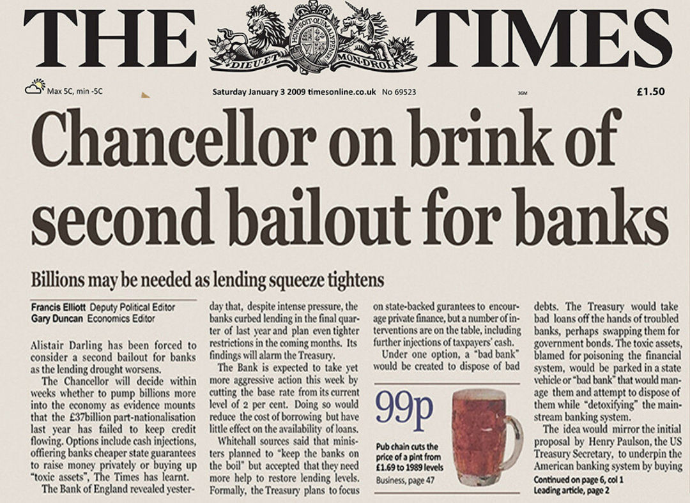
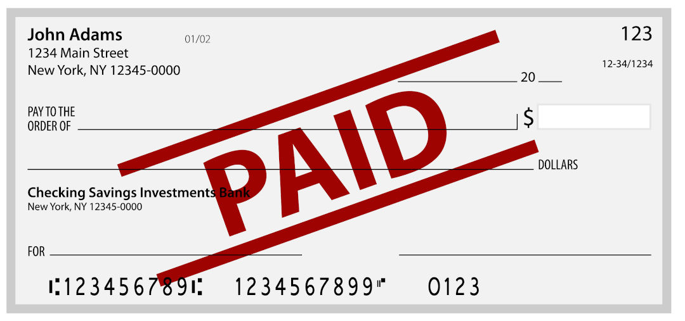
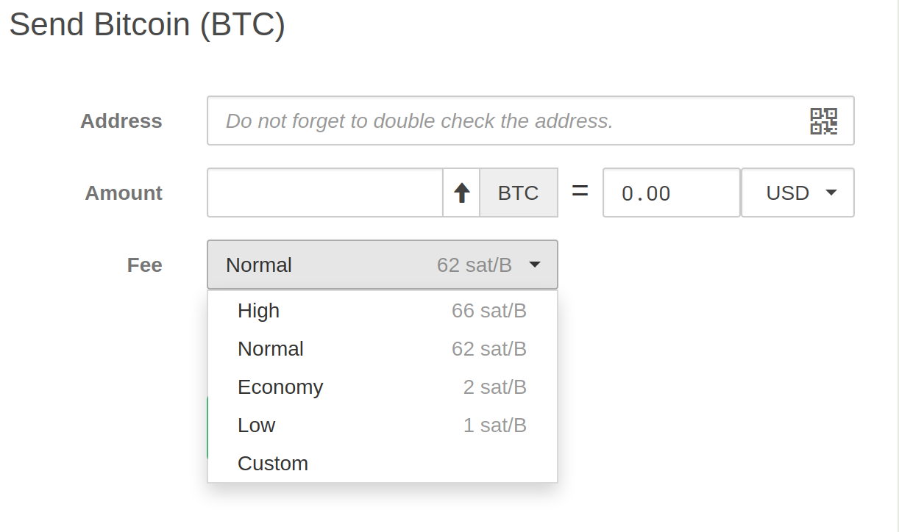
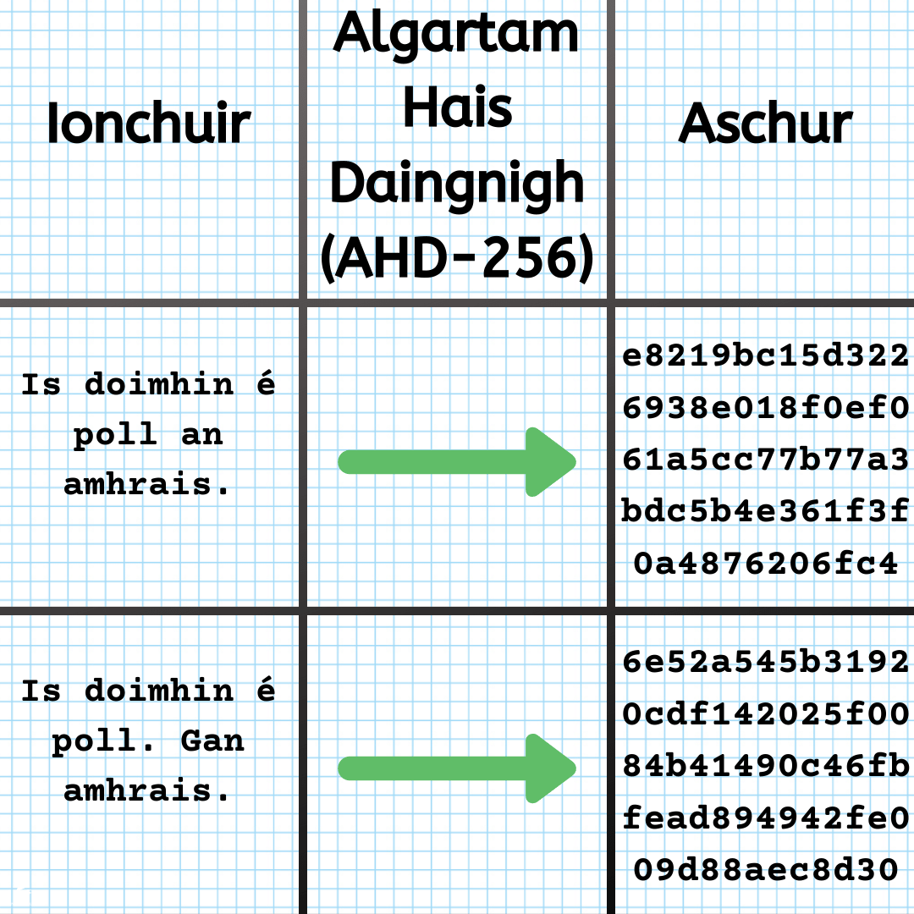
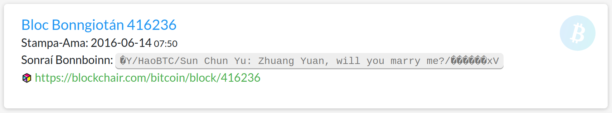
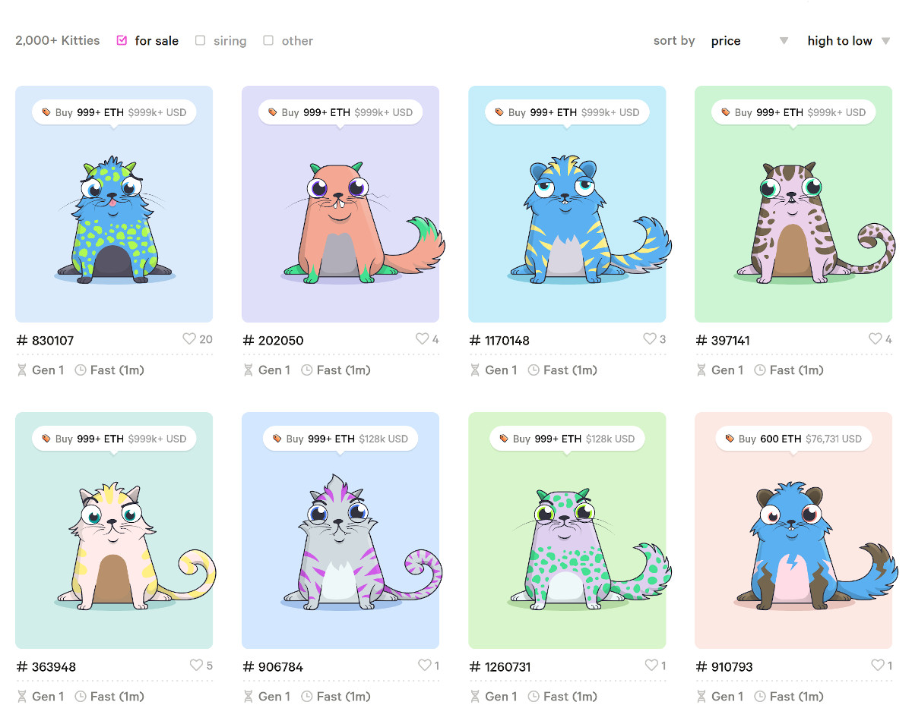

# Bonngiotán

## Ríomh-Airgid

Is **airgead idirlín** é **_Bonngiotán_** \[**bitcoin**\]. Is féidir Bonngiotán a sheoladh ag duine díreach cosúill le **ríomhphost**. Tá dhá phointe deachúlach ag an **Euro**, agus tugtar **cent** ar €0.01. Tá ocht bpointe deachúlach ag an Bonngiotán agus tugtar **satoshi** ar ₿0.00000001.

_**Tá go leor daoine ag úsáid an euro i bhfoirm dhigiteach amháin cheana féin**_

## Satoshi Nakamoto

**Satoshi Nakamoto** an t-ainm cleite a úsáideann cruthaitheoir(í) an Bonngiotán. Níl a fhios cé hé Satoshi Nakamoto. Is ainm firinscneach (masculine) ón tSeapán é Satoshi a chiallaíonn **_críona_** \[**wise**\]. Chruthaigh Satoshi profíl ar an bhfóram [p2pfoundation](https://web.archive.org/web/20110317060514/http://p2pfoundation.ning.com:80/profile/SatoshiNakamoto) sa bhliain 2008, chuir sé síos air fhéin mar **fhear Seapánach sna 30idí**. Déantar go leor plé ar [aitheantas agus ar spreagthaí](https://www.economist.com/technology-quarterly/2018/08/30/satoshi-nakamoto-bitcoins-enigmatic-creator) Satoshi Nakamoto.

_**Déantar tagairt do cheannlíne Times Shasana, 3ú Eanáir 2009, sa chéad bhloc den blockchain Bitcoin**_

## Caith Dúbailte

D’fhoilsigh Satoshi Nakamoto an páipéar bán [_**Bitcoin: A Peer-to-Peer Electronic Cash System**_](https://bitcoin.org/bitcoin.pdf) i bhFómhar 2008. Thug sé réiteach fíor chliste ar an bhfadhb, [**caith dúbailte**](https://www.investopedia.com/terms/d/doublespending.asp), a bhí ag cur mearbhaill ar chripteagrafaithe le scór bliain. Is éard é an caith dúbailte na an píosa ceannann céanna airgid a chaith faoi dhó.

_**Tógann sé laethanta seic a phróiseáil**_

_**Is minic go dteipeann ar seic ghlanadh**_

## Tríú Páirtí Iontaofa

Sula raibh Bonngiotán ann, má bhí tú ag iarraidh airgead a sheoladh ar an idirlíon, theastaigh **_tríú páirtí iontaofa_** \[**trusted third party**\] uait, cosúil le Banc na hÉireann, PayPal nó Mastercard. Deimhnítear leo seo go bhfuil a ndotháin airgid ag an seoltóir. Réitíonn siad aon fhadhb le haisíocaíochtaí nó aon díospóid.

_**Scéim cham taisce airgid idir-institiúideach ciorclach Banc Angla-Éireannach  
Foinse: [independent.ie](https://www.independent.ie/business/irish/anglo/6bn-fix-was-designed-to-make-bank-look-like-less-of-a-basket-case-29404959.html)**_

_**Athscríbhinn, aistrithe agus giorraithe de chomhrá teileafóin idir David Drumm agus John Bowe  
Foinse: [independent.ie](https://www.independent.ie/business/irish/anglo/6bn-fix-was-designed-to-make-bank-look-like-less-of-a-basket-case-29404959.html)**_

![Bowe: Tá an damhsa chun é a fháil ar ais in am ag éirí an-chrua. Íocaimid isteach sa bhanc [Irish Permanent]. Tugann an banc é don cuideachta árachais [Irish Life]. Tugann an cuideachta árachais ar ais dúinn é [Anglo Irish Bank]. Athscríbhinn giorraithe de chomhrá teileafóin idir David Drumm agus John Bowe ar an 29ú Méan Fómhar 2008.](../public/img/bitcoin/scéim-cham-taisce-airgid-idir-institiúideach-ciorclach-banc-angla-éireannach-3.jpg)

_**Athscríbhinn, aistrithe agus giorraithe de chomhrá teileafóin idir David Drumm agus John Bowe  
Foinse: [independent.ie](https://www.independent.ie/business/irish/anglo/6bn-fix-was-designed-to-make-bank-look-like-less-of-a-basket-case-29404959.html)**_

## Mórleabhar Dáilte

Tá an **_samhaltán slandála_** \[**security model**\], bunchloch an **_chóras airgeadaíochta_** \[**monetary system**\] a tháinig roimhe, casta bun os cionn ag an mBonngiotán. Ní theastaíonn an tríú páirtí iontaofa níos mó. Seachas cuntas **_mórleabhar_** \[**ledger**\] amháin atá rialaithe (go lárnach) ag aonán **_iontaofa_** \[**trustworthy**\] amháin, bheartaigh Bonngiotán ar mhórleabhar poiblí atá **_dáilte_** \[**distributed**\] go **_forleathan_** \[**extensively**\] ar a dtugtar **_blocshlabhra_** \[**blockchain**\].

_**Tá go leor cóipeanna den mhórleabhar Bhonngiotáin ar fud an idirlín**_

## Cripteagrafaíocht

Bhí an **ríomh-airgid** ina ábhar mór cainte i measc dream na **cripteagrafaíochta** ó cruthaíodh an t-idirlíon. Coinníonn cripteagrafaíochta an chumarsáid sabháilte mar tá an t-eolas á dhéanamh **_doiléir_** (obscure). Bheadh sé ríthábhachtach in aon chóras ríomh-airgead, agus is é seo an fáth go dtugtar **_criptea-airgeadra_** \[**cryptocurrency**\] ar Bonngiotán.

_**[Chruthaigh Julius Caesar](https://earlychurchhistory.org/military/julius-caesars-secret-code/) an córás chun a chomhfhreagras pearsanta agus, go háirithe, a chomhfhreagras míleata a thascradh**_

## Ríomh-Airgid

Déanadh iarrachtaí ríomh-airgid a chruthú roimh Bonngiotán. Bhí [**Ecash**](https://en.wikipedia.org/wiki/Ecash) ann ag tús na 90idí. Ina dhiaidh sin tháinig [**Bit gold**](https://en.wikipedia.org/wiki/Nick_Szabo#Bit_gold), [**RPOW**](https://en.wikipedia.org/wiki/Proof_of_work#Reusable_proof-of-work_as_e-money), agus [**b-money**](https://en.bitcoin.it/wiki/B-money). Bhí a gcuid fadhbanna fhéin leo ar fad agus dhá bharr théip orthu. [**Chreid Satoshi**](https://web.archive.org/web/20110525181920/http://p2pfoundation.ning.com/forum/topics/bitcoin-open-source?commentId=2003008%3AComment%3A9493) gur théip orthu mar go raibh siad ar fad **_rialaithe go lárnach_** \[**centrally controlled**\].

_**Is as Trá Lí, Co. Chiarraí é [Richard Cantillon](https://en.wikipedia.org/wiki/Richard_Cantillon). Is inspioráid é do cheannródaithe ríomh-airgead ar nós [Nick Szabo](https://twitter.com/NickSzabo4)**_

## Mianadóireacht

In Eanair 2009, sheol Satoshi [bogearra foinse oscailte](https://opensource.com/resources/what-open-source) saor in aisce, [**_Croílár Bonngiotán_**](https://github.com/bitcoin/bitcoin) \[**Bonngiotán Core**\]. Úsáidtear an bogearra chun an bhlocslabhra a chruthú agus a _chothabháil_ (maintain). Is **mianadoirí** a thugtar orthu siúd a úsáideann an bogearra agus is **mianadóireacht** an proiséas (mar go gcruthaíonn sé Bonngiotán nua). Tá na mianadóirí in iomaíocht lena chéile chun réiteach a fail ar an _bhfadhb cripteagrafach dochúlaithe_ \[**irreversible cryptographic puzzle**\]. Tá sé deacair an ceann is fearr a fail ar an bhfadhb ach is fuasta a dheimhniú go bhfuil sé réitigh.

_**Tá sá crua ciúb Rubik a réiteach, ach tá sé easca a fheicéal go bhfuil sé réitithe**_

## Cruthúnas-Oibre

Go foirmeálta tugtar córas **_cruthúnas-oibre_** \[**proof-of-work**\] ar an bpróiseas mianadóireachta. Is teicníc frith-spam é cruthúnas-oibre. Tá sé rud éigin cosúil le Google Captcha, nuair a bhíonn ort íomhánna áirithe a roghnú (roinnt oibre a dhéanamh) sular dtugtar _rochtain_ \[**access**\] chuig suíomh gréasáin.

_**Is dúshlán é CAPTCHA a fhíoraíonn daoine**_

## Sparán

Tá bogearraí eile ar fáíl ar a dtugtar **_sparán_** \[**wallet**\] chun Bonngiotán a **sheoladh**, a **stóráil** agus a **fháil**. Tá go leor sparán crua-earraí agus bogearraí ar fáil inniu. Éilíonn sparán crua-earraí slándáil mhéadaithe, ach [níl aon rud slán go hiomlán](https://westoahu.hawaii.edu/cyber/ledger-cryptocurrency-wallet-flaw/).

_**Sparán crua-earraí agus aip soghluaiste [Ledger](https://shop.ledger.com/pages/ledger-nano-x)**_

## Seoladh

Teastaíonn seoladh Bonngiotán chun Bonngiotán a fháil agus a stóráil. Ligeann sparán Bonngiotán duit seoltaí iolracha a chruthú, rud atá cosúil le cuntais bhainc iolracha a bheith agat.

_**Tá méid beagnach gan teorainn de sheoltaí Bonngiotán féideartha**_

## Súdanaithnid

Tugann an seoladh Bonngiotán **_súdanaithnideacht_** \[**pseudo-anonymity**\] dhuit. Déantar taiféad ar **sheoladh an _fhaighteoir_** \[**receipent**\] agus an méid Bonngiotán a fhaightear. Tá gach idirbheart Bonngiotán taifeadta ar bhlocshlabhra go deo. Tá sé **níos sabháilte** agus **níos príobháidaigh** [seoladh nua](https://en.bitcoin.it/wiki/Address_reuse) a úsáid i gcás gach idirbheart.

_**Níl idirbhearta Bonngiotán go hiomlán gan ainm nó neamh-inrianaithe**_

## Muinín

Roimh lár na 70idí, chun **teachtaireacht criptithe a sheoladh** bheadh ar an mbeirt **_eochair siméadracha rúnda_** \[**secret symmetric key**\] a roinnt lena chéile. Tá eochar (pasfhocal) amháin acu chun an t-eolas a chriptiú agus a díchriptiú. Caithfear a chinntiú go roinnfear an t-eochar ar bhealach slán, mar shampla _cúiréir_ \[**courier**\] nó post cláraithe. Níor eascaigh teileachumarsáid éifeachtach ghnó uaidh seo. D’athraigh rudaí nuair a d’fhoilsigh [Whitfield Diffie](https://cisac.fsi.stanford.edu/people/whitfield_diffie) agus [Martin Hellman](https://cisac.fsi.stanford.edu/people/martin_hellman) a bpáipéar [**_New Directions in Cryptography_**](https://ee.stanford.edu/%7Ehellman/publications/24.pdf) i bhfómhar na bliana 1976.

_**Is gá eochair siméadrach a roinnt ach tá baol leis**_

## Eochracha Poiblí-Príobháideacha

Mhol Diffie agus Hellman **dhá _eochair neamhshiméadracha_** \[**asymmetric keys**\] a úsáid. Bheadh ceann acu **coinnigh faoi rún** ag an t-úinéra agus bheadh an ceann eile **roinnte go poiblí**. Bheadh an eochair phoiblí á úsáid chun an t-eolas a **chriptiú** agus bheadh an eochair rúnda ag táisteal chun é a **díchriptiú**.

_**Tá sé úsáideach agus neamhdhíobhálach eochair phoiblí a roinnt. Níor cheart eochracha príobháideacha a roinnt.**_

## Sínithe Digiteacha

Is féidir _sláine_ \[**integrity**\] teachtaireacht a sheiceáil leis an eochair phoiblí. Tá an eochair phíobháideach á úsáid chun a chinntiú go bhfuil coras dosháraithe i bhfeidhm. Cinntíonn an próiséas seo nár athraigh an teachtaireacht agus nach bhféadadh ach an té leis an eochair phríobháideach é a scríobh.

_**Tá síniú digiteach cosúil le síniú dúch ar pháipéar**_

## Idirbheart

Go bunúsach is é seoladh Bonngiotán an eochair phoiblí de **péire eochracha poiblí-príobháidí**. Síníonn an eochair phríobháideach idirbheart Bonngiotán go digiteach. Fíoraíonn an eochair phoiblí an t-idirbheart. Fanann idirbhearta a chraoltar chuig líonra Bonngiotán le **hidirbhearta neamhdhearbhaithe** eile.

_**Sampla d’idirbheart atá á chruthú sa comhéadan úsáideora gréasáin sparán crua-earraí [Trezor](https://trezor.io/).**_

## Bloc

Roghnaíonn na mianadóirí na hidirbhearta is mian leo as an ngrúpa hidibhearta neamhdhearbhaithe ionas go bhféadfar iad a dhearbhú. Cuirtear na hidirbhearta isteach i struchtúr ar a dtugtar bloc. Tá bloc teoranta i méid ag thart ar 1-meigibheart, a thugann spás do thart ar [3,500 idirbheart](https://en.bitcoin.it/wiki/Maximum_transaction_rate).

![Léiriú simplithe ar na sonraí i mbloc Bitcoin. Comhartha Aitheantais Uathúil Nua: 0000000000000000000f67...de27d19, Comhartha Aitheantais Uathúil Roimhe: 0000000000000000000d80...1395a40, Stampa Ama: 2020-03-25 08:52, Height: 622886, Aird: F2Pool, # Idirbhearta: 2,931, Deacracht: 16,552,923,967,337.23, Méid: 1.344719MB, Ócáide: 408,115,700, Iomlán Bonngiotán: 10628.98283719 BTC, Duais Bloc: 12.50000000 BTC, Iomlán Táillí: 0.53265959 BTC, Liosta Idirbhearta: Duais + Táillí de 13.03265959 BTC chuig seoladh 1KFH...DbYY, seolann seoladh 1AUR...411j 0.29843774 BTC chuig seoladh 1HTf...vFoi, seolann seoladh 1HTf...vFoi 0.28939070 BTC chuig seoladh 1EyE...mksn.](../public/img/bitcoin/bloc-bonngiotán.jpg)

_**Cuid de na sonraí i mbloc Bonngiotán**_

## Blocshlabhra

Cruthaíonn gach mianadóir Bonngiotán bloc nua gach uair a réitítear an fhadhb roimhe. Chomh luath agus a réitíonn minéir an fhadhb, craolann siad a réiteach in éineacht lena mbloc. Má ghlactar leis mar réiteach bailí, nascann an bloc leis an mbloc a tháinig roimhe in ord _seicheamhach_ \[**sequential**\], agus tugann sé seo an **Blocslabhra Bonngiotán** dúinn.

_**I ngach bloc Bonngiotán tá comharthaG aitheantais uathúil an bhloc roimhe**_

## Deacracht

Chuile 2016 bloc (díreach coicís a thogann gach bloc nó méan na 2016 bloc, ná 10 noimead) déantar tomhas ar na deacrachtaí a bhaineann leo. Déantar measúnachán ar an léibheal deacracht a theastaíonn chun go dtógadh sé coicís na 2016 bloc a mhionnaigh. De réir an measunachán, laghdófar nó meadófar an deacracht.

_**Bíonn leibhéal deacrachta Bitcoin beagnach i gcónaí ag dul suas  
Foinse: [coinwarz.com](https://www.coinwarz.com/mining/bitcoin/difficulty-chart)**_

## Múnlú

Spreagann réiteach na faidhbe bronnadh Bonngiotán nua don mhianadóir rathúil. Is é seo an bealach a **chruthaítear** agus a **dháiltear** gach bitcoin nua. Tá mianadóireacht cosúil le [Banc Ceannais na hEorpa ag priontáil agus ag eisiúint Euro nua](https://www.ecb.europa.eu/press/pr/date/2016/html/pr160504.en.html).

_**Scríobh [Thomas Paine](https://en.wikipedia.org/wiki/Thomas_Paine) ionsaí fíochmhar ar airgead páipéir  
Foinse: [mises.org](https://mises.org/library/thomas-paine-paper-money)**_

## Laghdú

Laghdaíonn duais an Bhonngiotáin faoi leith chuile 210,000 bloc de bharr na socraithe atá déanta ar bhogearra Bonngiotán. Ar an **28ú Samhain 2012**, tháinig an chéad **laghdú** ó **50** go **25**. Bhí an dara laghdú ar an **9ú Iúil 2016** ó **25** go **12.5**. Tá súil leis an gcéad laghdú eile i **mí Bealtaine 2020**. Is féidir a bheith cruinn leis an dáta. Cinntíonn na bogearraí go bhfuil bloc nua á chruthú ar an meán chuile deich nóiméad.

_**Tá sé beartaithe go dtitfidh ráta boilsciú Bonngiotán faoi bhun sprioc 2% an Bhainc Ceannais Eorpaigh i gceann bliain nó dhó  
Foinse: [charts.bitcoin.com](https://charts.bitcoin.com/btc/chart/inflation#ek)**_

## Uasteorainn

Tá [teorainn de 21 milliún Bonngiotán](https://en.bitcoin.it/wiki/Controlled_supply) réamhshocraithe ag bogearraí Bonngiotán. Ceaptar go shroicheadh sé é seo sa bhliain 2140.

_**Tá ráta soláthair agus boilscithe Bonngiotán intuartha  
Foinse: [cointelegraph.com](https://cointelegraph.com)**_

## Táillí

Is féidir leis an seolteoir táille a chur san áireamh nuair atá siad ag cruthú idirbheart Bonngiotán. Go hiondúil socraíonn an sparán na táillí go _huathoibríoch_ \[**automatically**\] ach is féidir é a dhéanamh _le láimh_ \[**manually**\] freisin. Athraíonn [méid na táillí](https://bitinfocharts.com/comparison/bitcoin-transactionfees.html) ar an gréasán Bonngiotán go minic, ach go hiondúil bíonn an meán-tháille **faoi €1**. É sin ráíte, ag a _bhuaic_ \[**peak**\], ar an 22ú Nollaig 2017, bhí €45 mar mhéan-tháille.

_**Táillí Bitcoin i satoshis in aghaidh gach beart sonraí  
Tagairt: [bitcoinfees.earn.com](https://bitcoinfees.earn.com/)**_

## Linn Mianadóireacht

Nuair a thosaigh an blocshlabhra Bonngiotán in Eanair 2010, ní raibh mórán mianadóirí ag mianadóireacht. Ag an am bheadh beagnach aon ríomhaire le nasc idirlín in ann tosaigh ag mianadóireacht agus tar éis tamaill bhí seans acu réiteach a fáil ar an bhfadhb chun an duais a fáil. Bíonn duais chuile 10 noiméad, mar sin bíonn 144 duais chuile lá.

Roimh dheireadh 2010, bhí mianadóirí ag gearán go raibh siad ag mianadóireacht seachtain i ndiaidh seachtain, gan aon duais dhá bharr. Dhá bharr sin [thosaigh na linn mianadóireacht](https://bitcointalk.org/index.php?topic=1976.0). Bailíonn na mianadóirí le chéile mar ghrúpa chun seans níos fearr a bheith acu duais a fáil agus é a roinnt eatarthu.

![Aibréan 2020, píchairt de dháileadh cumhachta ríomhaireachta (haiseáil) idir na linn mianadóireachta. Tá f2pool.com, atá bunaithe sa tSín-SAM-AE, ar an mbarr le 18.5% den chumhacht haiseáil iomlán den líonra Bhonngiotán. Tá poolin.com, atá bunaithe sa tSín-SAM, sa 2ú háit le 15.9%. Tá pool.btc.com, atá bunaithe sa tSín-Singeapór, sa 3ú háit le 14.2%. Tá antpool.com, atá bunaithe sa tSín, sa 4ú háit le 11.4%. Tá 1thash.top, atá bunaithe sa tSín, sa 5ú háit le 6.3%. Tá huobipool.com, atá bunaithe sa tSín, sa 6ú háit le 6.2%. Tá viabtc.com, atá bunaithe sa tSín, sa 7ú háit le 6.1%. Tá slushpool, bunaithe i bPoblacht na Seice, san 8ú háit le 5.2%. Tá an 16.1% ag gach mianadóir eile.](../public/img/bitcoin/linn-mianadóireacht-bonngiotán.jpg)

_**Aibréan 2020 - Dáileadh cumhachta ríomhaireachta (haiseáil) idir na linn mianadóireachta  
Foinse: [miningpoolstats.stream](https://miningpoolstats.stream/bitcoin)**_

## Treallamh

Tá costas mór ag baint le trealamh mianadóireachta a shocrú suas. Nuair nach raibh mórán daoine ag mianadóireacht, bheadh aon ríomhaire caighdeánach inann a dhul in iomaíocht chun an fhadhb cripteagrafach dochúlaithe a réiteach.

Ach ansin, thosaigh daoine ar nós [ArtForz](https://en.bitcoin.it/wiki/ArtForz) ag úsáid suiteálacha le aonaid próiseála grafaice a bhí i bhfad níos sciobtha ag mianadóireacht ná an gnáth lárionad próiseála.

Timpeall na bliana 2013, thosaigh [hacadúlaithe ag caint](cseweb.ucsd.edu/~mbtaylor/papers/bitcoin_taylor_cases_2013.pdf) faoi treallamh atá deartha chun mianadóireacht amháin. Tháinig feidhmchlár nua ar an margadh, an **_Ciorcad Comhtháite AonFheidhmeach_** \[**Application Specific Integrated Circuit (ASIC)**\]. Is féidir iad a fáil ar [amazon](https://www.amazon.co.uk/Bitmain-Antminer-S9-13-5TH-s/dp/B01MCZVPFE/ref=mp_s_a_1_3?keywords=bitcoin+miner+asic&qid=1577370779&refinements=p_76%3A419158031&rnid=419157031&rps=1&sprefix=bitcoin+miner&sr=8-3) cosúil leis an [Antminer S9](https://www.amazon.co.uk/gp/offer-listing/B01MCZVPFE/ref=dp_olp_all_mbc?ie=UTF8&condition=all) (a dhéanann 13.5TH/s) atá ar fáíl ar Amazon.co.uk ar phraghsanna éagsúla m.sh. €100 faoi lathair.

_**Feirm mianadóireachta Bonngiotán i Sainte Hyacinthe, Québec**_

## Leictreachas

Tá dhá chostas mhór ag baint le mianadóireacht, an **trealamh** agus an **leictreachas**. Le Antminer S9, tá costas an leictreachas ag **€0.15/cileavatuair (KiloWatt/Hour)** agus luach **€7,500** ag Bonngiotánamháin, tar éis bliana bheadh thart ar luach **€500** de bhonngiotán buaite agat. Ach sa mbliain céanna bheadh **€1,500** cáite agat ar leictreachas.

Tá sé soiléir as sin nach bhfuil brabach le fáil ar an eangach náisiúnta in Éirinn. Ach, tá áiteanna cosúil le Quebec an tarraingteach do mhinadóirí. Tá na rataí leictreachas chomh híseal le €0.05/cileavatuair ag an bpobal i gcoitinne agus €0.01/cileavatuair ar fáíl do ghnólachtaí. Le deich mbliana anuas tá [fáilte](https://www.technologyreview.com/s/610786/bitcoin-is-eating-quebec/), [cosc](https://www.lesaffaires.com/blogues/francois-remy/le-gouvernement-isole-hydro-quebec-des-cryptomonnaies/602157), agus [fáilte arís](http://news.hydroquebec.com/en/press-releases/1487/the-regie-de-lenergie-hands-down-its-decision-in-the-blockchain-file/) curtha ag Québec roimhe mianadóirí Bonngiotán.

![In 2020, tá líonra mianadóireachta Bonngiotán ag baint úsáide as thart ar 75 TeireaVatUair leictreachais gach bliain. Lorg mianadóireachta bonngiotán bliantúil; Lorg carbóin: 34.64 Mt CO2. Inchomparáideach le lorg carbóin na Danmhairge. Leictreachas: 72.94 TeireaVatUair. Inchomparáideach le húsáid leictreachais na hOstaire. Lorg mianadóireachta idirbheart amháin; Lorg carbóin: 344.93 kg CO2. Inchomparáideach le lorg carbóin 862,321 idirbhearta VISA nó 57,488 uaireanta faire YouTube. Leictreachas: 726.16 kWh. Coibhéiseach le húsáid chumhachta ghnáth-theaghlaigh na Stáit Aontaithe Mheiriceá thar 24.54 lá.](../public/img/bitcoin/lorg-mianadóireachta-bonngiotán.jpg)

_**Lorg measta líonra mianadóireachta Bonngiotán  
Foinse: [BitcoinEnergyConsumption.com (digiconomist.net)](https://digiconomist.net/bitcoin-energy-consumption)**_

## Haiseáil

Úsáidtear **_haiseáil_** \[**hashing**\] chun sláine an blocshlabhra a choinneáil. Is _feidhm_ \[**function**\] é a thogann faisnéis de méideanna eagsúla mar _ionchur_ \[**input**\] agus as sin gheobhadh tú píosa téacs _uathúil_ \[**unique**\] _do fhad sheasta_ \[**of fixed length**\] mar _aschur_ \[**output**\]. is féidir leat triail a bhaint as [anseo](https://xorbin.com/tools/sha256-hash-calculator).

Seo é an próiseas atá ag tarlú le linn mianadóireacht. Tá na mianadóirí ag úsáid an blocshlabhra Bonngiotán uilig (faoi láthair beagnach 250GB i méid), chomh maith lena n-iarracht chun bloc nua a chruthú, mar ionchur. Le chéile, tá na mianadóirí ag déanamh 100,000,000,000,000,000,000 hais gach soicind.

_**Algartam Hais Daingnigh (AHD-256) \[Secure Hash Algorithm (SHA-256)\] - Samplaí ionchuir agus aschur**_

## Sláine

Is uirlis iontach é haiseáil chun sláine sonraí nó bogearraí a fhíorú. Tugann aschur an feidhm haiseáil síniú uathúil de sonraí nó bogearraí. Má athraítear fiú carachtar amháin den ionchur, tá an aschur go hiomlán difriúil.

_**Ligeann luachanna hais barántúlacht íoslódálacha ar líne a fhíorú**_

## Fadhb

Teastaíonn haiseáil chun réiteach a fáil ar fhadhb cripteagrafach dochúlaithe Bonngiotán. Tógtar an blocshlabhra Bonngiotán uilig agus bloc nua idirbheart mar inchur. Chun an fhadhb a réiteach teastaíonn aschur a thosaíonn le **méid áirithe náideanna**.

_**Méadaíonn deacracht nuair a mhéadaíonn cumhacht mianadóireachta**_

## Uimhir Ócáide

Chun aschur difriúl a fáil ar gach hais, is féidir [uimhir **_ócáide_**](https://en.bitcoin.it/wiki/Nonce) \[**nonce**\] sa réimse **0 go dtí 4,294,967,295** a chur sa mbloc. Fiú le os cionn 4 billiún roghanna, tá seans ann fiú dá mbainfidh triail as gach ceann nach mbeidh an t-aschur atá ag taisteal faighte agat. Tá rudaí eagsúla a féidir a athrú i mbloc, ar nós an stampa ama. Má athraítear é seo, is féidir na 4 billiún roghanna d’uimhir ócáide a thriail as a nua arís.

_**Míniú de Ócáide ar téarma.ie  
Foinse: [tearma.ie](https://www.tearma.ie/q/focal%20%C3%B3c%C3%A1ide/ga/)**_

## An Slabhra Is Faide

Nuair a chuireann mianadóir bloc nua ar an mblcoshlabhra, craoltar an blocshlabra nua ar an líonra Bonngiotán. Seo an leagan is faide den bhlocshlabhra. Tá riail ann leis an cód Bonngiotán go gcaithfear glacadh leis an mblocshlabhra is faide mar an fíor blocshlabhra. Déantar bailíochtú ar an mblocshlabhra nua agus má ghlactar leis, tosaíonn an proiséas mianadóireachta arís agus bíonn an slabhra nua mar ionchur. Mura nglactar leis an mbloc nua, déantar neamhaird air agus leantar ar aghaidh ag obair leis an leagan den bhlocshlabhra a tháinig roimhe.

_**Buann an slabhra is faide**_

## Do-Athraithe

Deirtear go bhfuil an blocshlabhra Bonngiotán **_do-athraithe_** \[**immutable**\]. Ciallaíonn sé seo nach féidir é a athrú agus dá bhrí sin ní féidir idirbheart Bonngiotán a _aisiompú_ \[**reverse**\]. Cruthaíonn an próiseas mianadóireachta idirbheart Bonngiotán atá neamhphraiticiúil go _ríomhaireachtúil_ \[**computationally**\] a aisiompú, chomh fada agus a rialaíonn mianadóirí macánta an blocshlabhra. Is as seo a thagann an téarma [**_an t-ionsaí 51%_**](https://en.bitcoin.it/wiki/Majority_attack) \[**the 51% attack**\]. Seo cás ina bhfuil níos mó ná 50% de na mianadóirí ag obair le chéile chun idirbheart\[a\] atá ar an mblocshlabhra a chealú.

_**B’fhéidir nach mbeidh an pósadh do-athraithe i gcónaí ach tá an togra seo atá scríofa i mbloc Bonngiotán 416236  
Foinse: [blockchair.com](https://blockchair.com/search?q=marry%20me)**_

## Ionsaí 51%

Níl móran bealaí a féidir ionsaí a dhéanamh ar shláine blocshlabra Bonngiotán. Níl ach bealach amháin i ndáiríre agus fiú leis seo, ní bheadh sé i bhfad go mbeadh an tsláine athchóirithe arís. Ar dtús, ní fheadfadh idirbheart Bonngiotán a chruthú mura bhfuil seoladh (agus an eochar phríobháideach) Bonngiotán agat agus méid bonngiotain ag an seoladh sin.

An t-aon rud a féidir a dhéanamh ná triail a bhaint as an Bonngiotán céanna a sheoladh an dara huair. Dá mbeadh an oiread sin cumhachta ag grúpa nó grúpaí de mhianadóirí go mbeadh siad inann bloc nua a chruthú, idirbheart airid a bheith ann, agus ansin bloc eile a dhéanamh leis an idirbheart ag seoladh an bhonngiotán céanna ach chuig seoladh difriúil; seo é an caith dúbailte.

Ach, ní ghlacfar ach le ceann de na hidirbhearta agus dhá bhrí sin, deirtear go bhfuil sé níos sabháilte fanacht go mbeidh thart ar 4 go 6 bhloc (40 go 60 nóimead) eile curtha ar bharr an bhlocshlabhra chun a bheith cinnte nach mbeidh an t-idirbheart aisiompaithe.

_**Minéir bradach ag obair ar dhá shlabhra ag aon am**_

_**Caithfidh an minéir bradacha slabhra B a shíneadh sular féidir le mianadóir eile slabhra A a shíneadh**_

## Bailíochtóirí

Is féidir a bheith mar **_bhailíochtóir_** \[**validator**\] amháin ar líonra Bonngiotán. Teastaíonn roinnt achmhainní líonra chun déileáil leis an mblocshlabhra. Faoi láthair, tá sé os cionn **250GB** i méid agus bheadh sé le híoslódáil ar dtús. De réir an suíomh bitcoin.org, d’fhéadadh [200GB a uasódáil agus 20GB a íoslódáil gach mí](https://bitcoin.org/en/full-node).

_**Tá blocslabhra Bonngiotán ag méadú i gcónaí  
Foinse: [blockchain.com](https://www.blockchain.com/charts/blocks-size)**_

## Méid Bloc

Tá [díospóireacht mór](https://en.bitcoin.it/wiki/Block_size_limit_controversy) i gconaí faoi méid 1 MB (meigibheart) na bloic i mBonngiotán agus na teorainneacha a chruthaíonn sé ar an méid idirbhearta a féidir a chur i mbloc amháin. Cruthaíonn sé scoilteanna i bpobal an Bhonngiotáin. Tá daoine ag iarraidh méid na bloic, agus dhá bhrí sin méid na hidirbhearta, a choinnéal íseal mar go bhfeiceann siad Bonngiotán mar stór luacha cosúil le ór. Tá daoine eile ag iarriadh bloic níos mó chun spás a bheith acu le níos mó hidirbhearta agus táillí níos ísle mar is airgead laethúil dóibh siúd an Bonngiotán.

_**Tá an díospóireacht faoi mhéid na mbloc tar éis pobal Bitcoin a roinnt**_

## Foirc

Tá forcanna coitianta i mbogearraí agus tá na mílte acu i mbogearraí Bonngiotán. Leis an foirc déantar cóip de chódanna na mbogearraí. Déantar foirceanna chun athruithe suntasacha a dhéanadh ar an gcód.

I 2011, thosaigh [**_Bonntanaí_ \[Litecoin\]**](https://github.com/litecoin-project/litecoin) mar foirc de [chód Bhonngiotáin](https://github.com/bitcoin/bitcoin). Laghdaigh Litecoin am an bhloc síos go dtí 2.5 noiméad (10 noiméad i mBonngiotán). Meadaíonn Litecoin uastheorainn na boinn go dtí 84 milliún (21 milliún i mBonngiotán). Freisin, úsáideann Litecoin feidhm haiseáil difriúil, [**scrypt**](http://www.tarsnap.com/scrypt.html), i gcomparáid le **SHA-256** i mBonngiotán.

_**I mí Dheireadh Fómhair 2011, eisíodh Bonntanaí tar éis dó a bheith brionnaithe ó Bonngiotán (Cór)**_

## Scoilt

I **2017**, cruthaíodh foirc de Bhonngiotáin inár meadaíodh méid an bhloic uaidh **1MB** go dtí **8MB** mar iarracht chun réiteach a fáil ar an díospóireacht faoi mhéid na bloic. Chruthaigh sé scoilt sna mianadóirí agus chruthiagh sé leagan nua de Bhonngiotáin ar a dtugtar [**_Bonngiotán Airgead_ \[Bitcoin Cash\]**](https://www.bitcoincash.org/) mar foirc de Bhonngiotáin. I 2018, tháinig scoilt eile nuair a cruthú [**Bonngiotán SV (Satoshi Vision)**](https://bitcoinsv.io/) mar foirc de Bonngiotán Airgead de bharr níos mó díospóidí.

_**I mí Lúnasa 2017, chuir Bonngiotán Airgead bloic 8MB i bhfeidhm**_

_**Earraigh 2020, táillí idirbhirt Bonngiotán (Cór) & Bonngiotán Airgead  
Foinse: [bitcoinfees.cash](https://bitcoinfees.cash/)**_

## Aerscaoileadh

Tugann na forcanna seo bónas ar a dtugtar **_aerscaoileadh_** \[**airdrop**\] dóibh siúd a bhfúil boinn acu roimhe an forc. Má bḣí méid áirithe **Bonngiotán** agat roimhe an foirc a chruthaigh **Bonngiotán Airgead**, bheadh an uimhir céanna de Bonngiotán Airgead agat tar éis an foirc. An rud céanna le **Bonngiotán SV**, mar gur tógadh an foirc uaidh Bonngiotán Airgead, bheadh an uimhir céanna de Bonngiotán SV agat tar éis an foirc agus a bhí agat de Bonngiotán Airgead roimh an foirc.

_**Thosaigh [Stellar Lumens](https://www.stellar.org/), [NEM](https://nem.io/) agus [Bitcoin Airgead](https://www.bitcoincash.org/) mar aerscaoilte 'saor in aisce'**_

## Malartán

Is éard atá i malartán criptea-airgeadra ná ardán chun criptea-airgeadra a cheannacht le euro. Tósaíonn go leor daoine le criptea-airgeadra ar an mbealach seo, ach tá imní slándála leo. Tá [**_haiceáil_**](https://www.cnbc.com/2018/03/21/how-to-pick-the-best-cryptocurrency-exchange.html) \[**hack**\], [**_sceamálacha_**](https://www.justice.gov/usao-or/pr/two-canadian-nationals-sentenced-federal-prison-bitcoin-fraud) \[**scams**\] agus [**_féimheachta_**](https://www.ft.com/content/6636e0e8-a06e-11e3-a72c-00144feab7de) \[**bankruptcies**\] flúirse i stair ghearr deich mbliana malartání criptea-airgeadra.

_**Comhlíonann [Coinbase](https://coinbase.com) agus [Kraken](https://kraken.com) na rialacháin in aghaidh Sciúradh Airgid agus Fios-do-Chustaiméirí  
Tá [Binance](https://www.binance.com) ag éirí [níos géilliúla](https://www.coindesk.com/binance-tightens-compliance-turning-to-identitymind-for-kyc)**_

## Conradh Cliste

I **2015**, lainseáil Vitalik Buterin, ríomhchláraitheoir Rúiseach-Ceanadach, leagan **_in-ríomhchláraithe_** \[**programmable**\] de bhlocshlabhra ar a dtugtar [**Ethereum**](https://ethereum.org/). Is ardán é Ethereum chun feidhmchláir a rith ar a dtugtar **_conarthaí cliste_** \[**smart contracts**\]. Is conarthaí **_féin-forghníomhaigh_** \[**self-executing**\] iad atá scríofa i gcód ríomhaire. Foilsítear agus ritheann na conarthaí ar an mblocshlabhra. Tá an chumhacht acu a bheith neamhspleách agus dosháraithe.

Tá criptea-airgeadra dúchais ag an bhlocshlabhra Ethereum ar a dtugtar Ether (ETH). Éascaíonn an bhlocshlabhra Ethereum cruthú **_licíní-criptea_** \[**crypto tokens**\] freisin.

_**[Vitalik Buterin](https://vitalik.ca/) comhbhunaitheoir Ethereum agus comhbhunaitheoir Iris Bonngiotán**_

## Licíní

Is cinéal criptea-airgeadra iad **licíní criptea** ach go minic is ionann iad agus sócmhainn ar nós pointí i gclár dílseachta nó scaireanna in eagraíocht. Chruthaigh cruthaitheoirí [Firefox](https://www.mozilla.org) an [**_Licín Aird Bunúsach_**](https://basicattentiontoken.org/) \[**Basic Attention Token**\] agus é mar aidhm acu _"éifeachtúlacht fógraíocht digiteach a fheabhsú go radacach"_.

_**Éilíonn BAT go bhfuilfógraíocht digiteach lofa le idirghabhálaithe, rianta agus caimiléireacht  
Foinse: [basicattentiontoken.org](https://basicattentiontoken.org/)**_

## DApps

Is feidhmchláir iad [**_Feidhmchláir Díláraithe_**](https://www.stateofthedapps.com/whats-a-dapp) \[**Decentralised Applications (DApps)**\] a ritheann ar blockchain agus a chomhlíonann critéir áirithe. Is é an ceann is tábhachtaí ná go gcaithfidh sé a bheith foinse oscailte ionas gur féidir le duine ar bith breathnú ar an gcód. Ba é ceann de na chéad DApps cluiche cosúil le [**Tamagotchi**](https://tamagotchi.com/) darb ainm [**_PuisíníCriptea_**](https://www.cryptokitties.co/) \[**CryptoKitties**\]. Laistigh de laethanta an lainseáil, bhí PuisíníCriptea ag trádáil ag luachanna níos mó ná [**€100,000**](https://www.cryptokitties.co/search?include=sale&orderDirection=desc&search=gen:1%20cooldown:fast).

_**[PuisíníCriptea](https://www.cryptokitties.co/search?include=sale&orderDirection=desc&search=gen:1%20cooldown:fast) le díol**_

## NFT

Léirigh an cluiche neafaiseach **PuisíníCriptea**, gné thar a bheith cumhachtach agus úsáideach de **blocshlabhra** in éineacht le **conarthaí cliste**, [**_Licín Neamh-Idirmhalartach_**](https://medium.com/fitzner-blockchain-consulting/exploring-non-fungible-tokens-a7e050e1616e) \[**Non-Fungible Token (NFT)**\] Léiríonn licín neamh-idirmhalartach úinéireacht sócmhainní digiteacha nach féidir a mhodhnú. Ligeann sé an fhéidearthacht sócmhainní digiteacha, ar nós íomhánna, ríomhleabhar, nó PuisínCriptea a chruthú. Dearbhaíonn sé líon na gcóipeanna bailí atá ann agus cé leis iad.

Tá [iarratas ar phaitinn](http://patft.uspto.gov/netacgi/nph-Parser?Sect1=PTO2&Sect2=HITOFF&p=1&u=%2Fnetahtml%2FPTO%2Fsearch-bool.html&r=1&f=G&l=50&co1=AND&d=PTXT&s1=Nike&s2=Crypto&OS=Nike+AND+Crypto&RS=Nike+AND+Crypto) déanta ag **Nike** chun an modh seo a úsáid chun sócmhainní digiteacha a chruthú atá nasctha le cóipeanna de bhróga fisiciúla iarbhír a díoladh.

_**Thóg Nike inspioráid ó [PuisíníCriptea](https://www.cryptokitties.co/)**_

## DAO

In áit daoine, tá [**_Eagraíocht Uathrialach Díláraithe_**](https://en.wikipedia.org/wiki/Decentralized_autonomous_organization) \[**Decentralised Autonomous Organisation (DAO)\]** rialaithe ag rialacha atá leagtha síos i gcód ríomhaire . Cuireann Bonngiotán **deireadh leis an ngá atá le banc ceannais airgeadra nó banc tráchtála** chun airgead a eisiúint nó chun idirbheart ar líne a bhailíochtú. Tugann Ethereum i bhfad níos mó féidearthachtaí chun tríú páirtithe agus idirghabháil **an duine a dhíothú** in idirghníomhaíochtaí agus idirbhearta ar líne.

_**Cuireann STEEM ardáin ar fáil le haghaidh [blagála](https://steemit.com/), [cluichí](https://steemmonsters.com/) agus [físeáin](https://d.tube/)**_

_**Tairgeann [AUGUR](https://www.augur.net/) gealltóireacht gan teorainn**_